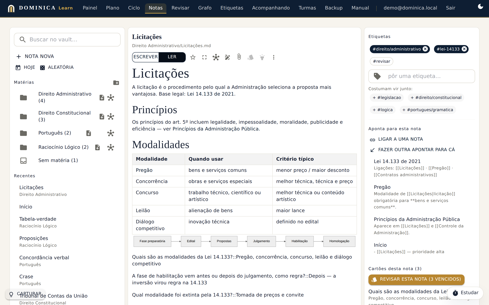
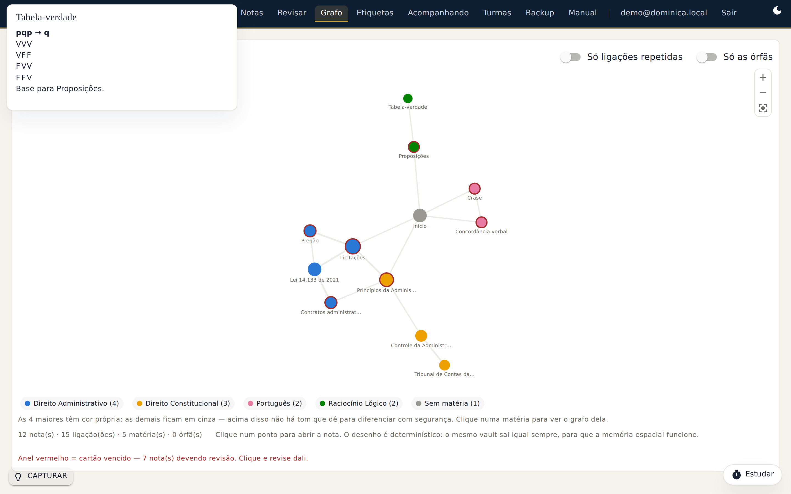
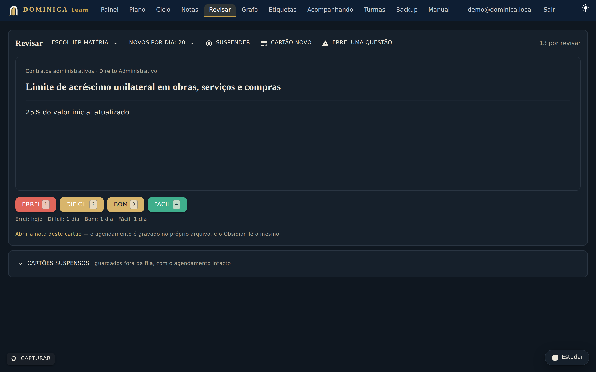
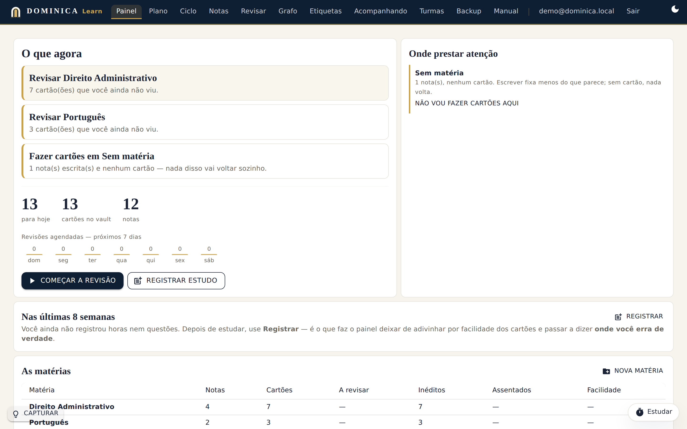
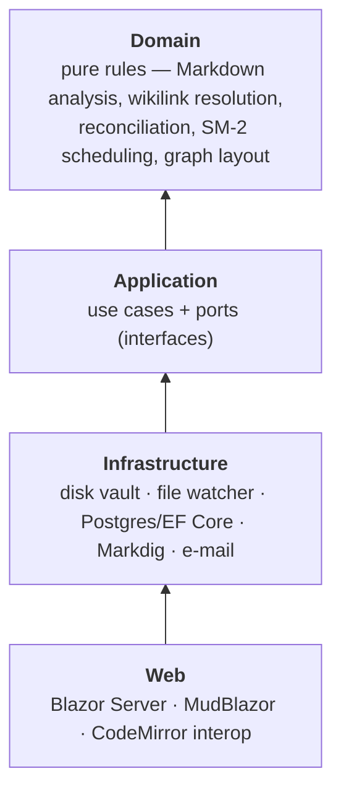

# Dominica Learn

[](https://github.com/matheusd0mingos/dominica-learn/actions/workflows/ci.yml)


[](LICENSE)

**A knowledge-management and spaced-repetition platform for long-term study** (public-service exams,
technical standards, books), built around one promise: **your vault is a folder of plain `.md` files,
and the same folder opens in Obsidian Desktop.**

*[Leia em português ↓](#em-português)*



<table>
  <tr>
    <td></td>
    <td></td>
  </tr>
  <tr>
    <td align="center"><sub>Vault graph, computed in C#, deterministic layout</sub></td>
    <td align="center"><sub>SM-2 review queue (dark theme)</sub></td>
  </tr>
</table>



---

## Why it exists

Study apps keep your notes hostage in their database. Obsidian keeps them in files, but it's a
single-user desktop app with no study plan, no performance tracking and no way to share a subject
with a study group. Dominica Learn is the web layer on top of a folder of Markdown:

- **Notes** — wikilinks, backlinks, hierarchical tags, attachments, templates, favourites, daily
  notes, version history, rename with automatic link rewriting, quick switcher, `[[` autocomplete.
- **Flashcards** — `question::answer` and cloze (`==highlight==`) cards written *inside* the note,
  scheduled with SM-2 and stored in the same `<!--SR:...-->` format as Obsidian's spaced-repetition
  plugin. Interleaved queue, daily cap on new cards, suspend, "I got a question wrong → card", Anki export.
- **Study system** — dashboard ("what should I study now?"), study plan and cycle, session and
  question logging, 8-week performance history per subject.
- **Graph** — whole vault or per subject, orphan detection, overdue notes highlighted.
- **Sharing** — study groups (*turmas*), following someone else's progress, public read-only links
  to a single note.
- **Your data is yours** — full vault export/import as `.zip` (with zip-slip and zip-bomb defences),
  including the study log as Excel-friendly CSV.
- **Accounts** — ASP.NET Core Identity with passkeys and 2FA; closed sign-up by default.

## Engineering highlights

The interesting part of this project is not the feature list — it's the constraint behind it. Because
the vault must open in Obsidian, **files change behind the application's back** (an open Obsidian, a
`git pull`, a cloud sync, an `mv` in the terminal). Every major design decision follows from that:

| Decision | Why |
|---|---|
| **The disk is the source of truth; the index is derived and disposable.** | Dropping the Postgres index and rebuilding it from the vault is routine, not disaster. Nothing that exists only in the index may be user knowledge. |
| **Full reconciliation, not event-by-event sync** | `FileSystemWatcher` drops events under load. Comparing disk and index as a whole is *self-healing*: miss an event and the next pass fixes it. The watcher waits for 750 ms of silence before acting. |
| **Content fingerprint (SHA-256), not `mtime`** | Cloud sync and `git checkout` rewrite timestamps of untouched files. The hash tells real change from noise — and detects renames (same content, new path). |
| **Note identity is its path, not a GUID** | A GUID doesn't exist on disk and breaks the moment someone renames outside the app. The price — rename changes identity — is paid by rewriting incoming wikilinks. |
| **Conflicts are never auto-resolved** | If the file changed on disk since the editor loaded it, saving is refused. The other side may be half an hour of work in Obsidian. |
| **Tenant isolation that fails closed** | One folder per user on disk and an EF Core global query filter in the database. A query that forgets the user returns *nothing*, never someone else's note. Proven with tests and with two real accounts in the browser. |
| **Results instead of exceptions** | "Note not found" and "file changed underneath" are everyday events here, not exceptional ones. |
| **JavaScript is confined** | CodeMirror, Mermaid and KaTeX live behind a single C# port (`IEditorDeTexto`); swapping the editor touches two files, not twenty pages. |

### Architecture

Hexagonal (ports & adapters). Project references only point inwards, so the compiler enforces what
the diagram promises: `Domain` *cannot* reference `Infrastructure`.



Most of the core — the reconciler, the wikilink resolver, the link rewriter, card scheduling — is
**pure functions**. That's what allows testing "whole folder moved", "duplicate content swapping
places" or "Windows syncing with Linux" with two literal lists, without touching a disk.

### Quality

- **~990 automated tests** across Domain, Application, Infrastructure and Web — no database, no
  network, the whole suite runs in seconds.
- **Playwright end-to-end suite** against the real app and a real Postgres, for what only a browser
  can see (a table clipped by CSS, a missing button, a download that never arrives). It measures
  *relationships* (`tableWidth > columnWidth`), not pixels, so it doesn't break on a font change.
- **Warnings are errors** (`TreatWarningsAsErrors`, nullable reference types, code-style enforced in build).
- **CI** on GitHub Actions runs both suites, the E2E one against a Postgres service container.
- Production-minded: non-root container, no port published (TLS terminates at the reverse proxy),
  health checks, OpenTelemetry, secrets only from the environment, restrictive CSP (with its one
  known concession documented).

## Tech stack

**Backend** C# / .NET 10 · ASP.NET Core · Blazor Server · EF Core · PostgreSQL · ASP.NET Core Identity
(passkeys, 2FA) · Markdig · OpenTelemetry
**Frontend** MudBlazor · CodeMirror · Mermaid · KaTeX
**Testing** xUnit · Playwright
**Ops** Docker (multi-stage, non-root) · Docker Compose · GitHub Actions

## Running it

**Tests** — need neither a database nor network:

```bash
dotnet test Dominica.Learn.slnx
```

**Development** — needs a local Postgres with user/password `learn`/`learn` and the databases
`learn_indice`, `learn_identidade` and `learn_registro` (see `appsettings.Development.json`):

```bash
dotnet run --project src/Dominica.Learn.Web
```

**End-to-end** — same Postgres; the suite boots the app itself on a throw-away vault:

```bash
cd e2e && npm ci && npx playwright install chromium && npx playwright test
```

**Production** — copy `.env.exemplo` to `.env`, point `VAULT_NO_HOST` to the folder you open in
Obsidian, then:

```bash
docker compose up -d
```

The app publishes no port on the host; put a reverse proxy (Caddy, Nginx, Traefik) in front of it.
Details in [docs/DEPLOY.md](docs/DEPLOY.md).

## Documentation

The docs are in Portuguese and explain the **why** — every decision, and the price paid for it.

| Document | What it covers |
|---|---|
| [docs/ARQUITETURA.md](docs/ARQUITETURA.md) | Architecture, the decisions behind it and their trade-offs, known debts |
| [docs/NORTE.md](docs/NORTE.md) | Product direction: from note vault to study system (syllabus, performance log) |
| [docs/COMPARTILHAMENTO.md](docs/COMPARTILHAMENTO.md) | Sharing design: study groups, access decisions |
| [docs/DEPLOY.md](docs/DEPLOY.md) | Deployment, backups, operations |
| [e2e/README.md](e2e/README.md) | How the browser suite works and how to write a test for it |

## Repository layout

```
src/
  Dominica.Learn.Domain/          pure rules: vault, analysis, links, cards, graph, study, sharing
  Dominica.Learn.Application/     use cases and ports
  Dominica.Learn.Infrastructure/  disk, Postgres, file watcher, rendering, e-mail
  Dominica.Learn.Web/             Blazor Server UI, routes, security, JS interop
tests/                            one xUnit project per layer
e2e/                              Playwright suite
docs/                             architecture, product direction, sharing, deploy
```

---

## Em português

**Plataforma de gestão de conhecimento e revisão espaçada para estudo de longo prazo** — concursos
públicos, normas técnicas, livros, base de conhecimento pessoal.

O vault são arquivos `.md` numa pasta do disco. **A mesma pasta abre no Obsidian Desktop** — essa é a
promessa central, e é ela que determina a arquitetura inteira: se os arquivos mudam pelas costas da
aplicação, então **o disco é a fonte da verdade e o índice é derivado e descartável**.

- Notas com wikilinks, backlinks, etiquetas hierárquicas, anexos, templates, histórico de versões e
  renomeação que reescreve as ligações.
- Flashcards SM-2 gravados no próprio `.md`, no formato do Obsidian; fila intercalada, teto de
  inéditos, lacunas, cartão a partir de questão errada, exportação para o Anki.
- Painel, plano e ciclo de estudos, registro de horas e questões, desempenho por matéria.
- Grafo do vault, turmas, acompanhamento e link público de nota.
- Exportar e importar o vault inteiro, com o registro de estudo em CSV.

Arquitetura hexagonal em .NET 10 com Blazor Server e PostgreSQL, cerca de 990 testes automatizados sem
banco nem rede, e uma suíte E2E em Playwright contra o app real. Comece por
**[docs/ARQUITETURA.md](docs/ARQUITETURA.md)**: explica por que cada decisão foi tomada e qual foi o
preço dela.

## License

[MIT](LICENSE) © Matheus Domingos
